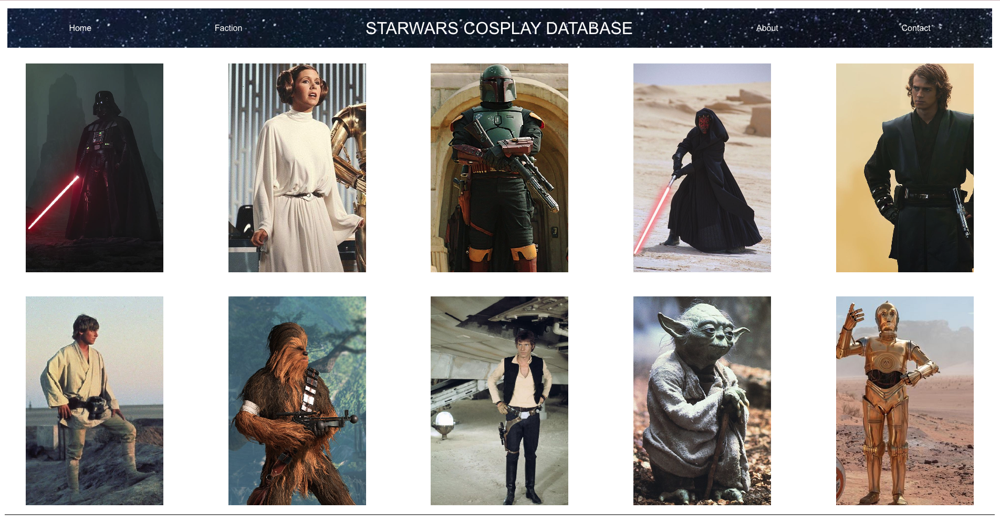

# Star Wars Cosplay Database
#### Aubrey Johnston, Brandon Graham, Flora Bernardo, Daniella Ferrufino, Kenneth Nilsson-Snow
 

## Technologies Used
<ul>
    <li>HTML</li>
    <li>CSS</li>
    <li>Javascript</derli>
</ul>    

 

## Description
The purpose of this site is to give users a place where they are able to find detailed information about a Star Wars character so that they can make a costume based off of that person and their features. The APIs that we chose to use were the SWAPI (Star Wars API) and Youtube. We chose these because we felt they were the best for helping users find information on these characters. A challenge we faced was finding if the Youtube API would work, but in the end we got it figured out!

 

## Table of Contents
<ul>
    <li>Installation</li>
    <li>Usage</li>
    <li>Credits</li>
    <li>Tests</li>
</ul>

 

## Installation
No installation required. Just visit the deployed website link:
 

<link>https://florabernardo62.github.io/starwarsdatabase/</link>

 

## Usage
Click the photo of the character that you want more information on and a box will appear on the screen that showcases the detailed descriptions of each character. You will get information such as height, eye color, hair color, and gender. As well as information on the characters, users will also be presented with Youtube video links relating to the character they have clicked on.

By default the site is built with a light theme. The 'Faction' button allows you to select the theme for the side. Selecting 'Dark Side' will change the site styling to a dark theme, and the 'Light Side' button will change the site styling to a light theme. 

   

 

## Credits

<li>Bulma styled framework documentation<li>
<link>https://bulma.io/documentation/</link>

 

## Tests

1. Navigate to the homepage of the deployed site: https://florabernardo62.github.io/starwarsdatabase/

2. Confirm that when selecting a character card that a new section box appears and provides information on the character as well as a couple YouTube links to related videos. 

3. Confirm that when selecting the 'Faction' button in the nav bar that a modal pops up with 2 buttons, 'Dark Side' and 'Light Side' 

4. Confirm that when selecting 'Dark Side' the page theme is switched to a dark mode styling, and the modal closes.  

5. Confirm that when selecting the 'Light Side' the page theme is switched to a light mode styling, and the modal closes. 

6. Confirm the 'About' button within the nav bar navigates to the 'About' page with details regarding the project. 

7. Confirm that when selecting 'Home' on the About page that it routes back to the main page and retains the styling previously selected. 

8. Confirm the 'Contact' button within the nav bar navigates to the 'Contact' page with a list of the project group members.

9. Confirm that when clicking a name on the 'Contact' page that you are routed to the individuals GitHub page. 

10. Confirm that when selecting 'Home' on the About page that it routes back to the main page and retains the styling previously selected. 

11. Set the theme to 'Dark Mode' and confirm that when refreshing the page the theme remains dark, as the theme is stored within the local storage. 
